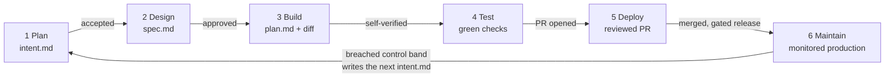

# Claude SDLC Starter

A working boilerplate for the **AI-native SDLC** described in Anthropic's
[The AI-Native SDLC Playbook](https://claude.com/blog/the-ai-native-sdlc-playbook).
Every play from the article exists here as a real file you can read, run,
and copy into your own repository.

The premise: code is no longer the bottleneck. When agents write most of
the diff, the human-speed stages around the build — plan, review, deploy —
become the constraint, and controls that assume a human performs every step
stop matching reality. The AI-native SDLC keeps the old control objectives
(accountability, separation of duties, auditability) and changes the
enforcement: the process becomes a loop of committed artifacts, AI is
embedded at each point, and governance runs as the agent acts.



A stage ends by committing an artifact; the commit initiates the next
stage. The chain of commits is also the audit trail: who asked for what,
what the agent produced, and who approved it. Humans stay accountable for
every decision that requires judgment — their attention concentrates at
the gates.

## What's in the box

```
├── CLAUDE.md                      Institutional knowledge the agent reads every session
├── REVIEW.md                      The review policy every PR gets, identically
├── Makefile                       One-command feedback loop: build / test / lint / run
├── intent/                        The intent home — the artifact chain per change
│   └── claims-status-self-service/   Worked example: intent.md → spec.md → plan.md
├── src/claims_api/                The code that implements the worked example
├── tests/                         The proof named in plan.md (the feedback loop)
├── templates/                     Blank intent.md / spec.md / plan.md templates
├── .claude/
│   ├── settings.json              Permissions + hook wiring, shared by the whole team
│   ├── hooks/                     production-gate, protect-paths, protect-tests, lint-on-edit
│   ├── skills/                    intent-capture, secure-api-review, brand-voice
│   ├── agents/                    verifier, code-simplifier, researcher subagents
│   └── commands/                  /capture-intent, /write-spec, /babysit-pr
├── .github/
│   ├── CODEOWNERS                 Separation of duties: humans approve, agents never
│   └── workflows/                 ci, agent-evals, claude-review, spec-from-intent, monitor
├── evals/                         Regression suite for the agent's configuration
├── monitoring/                    Stage 6: deterministic detection + control bands
├── managed-settings/              The regulated-enterprise control set (worked example)
├── scripts/check-endpoints.sh     Deterministic backstop for the security skill
└── docs/                          Playbook→repo map, governance model, metrics
```

Start with **[docs/playbook-map.md](docs/playbook-map.md)** — it maps every
play in the article to its file here and shows the adoption-order
dependency graph. **[docs/governance.md](docs/governance.md)** explains the
control layers; **[docs/metrics.md](docs/metrics.md)** lists each play's
leading and lagging indicators.

## Quickstart

```bash
git clone <this repo> && cd claude-sdlc-starter
make build && make test && make run        # the feedback loop works day one
python3 monitoring/detect.py               # watch the 3σ breach classify itself
claude                                     # Claude Code picks up CLAUDE.md,
                                           # settings, skills, hooks, agents
```

Then walk one change around the loop:

1. **Plan** — `/capture-intent customers can't see claim status` and let
   the `intent-capture` skill interview you into an `intent.md`. Committing
   it is the accept gate. (Non-engineers do this from claude.ai or Cowork
   via a GitHub connector — no git required.)
2. **Design** — `/write-spec intent/<change>/intent.md`. The skills
   constrain the spec (security, brand); concerns come flagged. In CI, the
   `spec-from-intent` workflow fires this pass automatically when an intent
   merges. The product owner reviews the spec — they don't write it.
3. **Build** — start Claude Code **in plan mode** with the accepted spec.
   Interrogate the plan (what could break, which step is riskiest, what
   was rejected), iterate until someone who never saw the conversation
   could implement from it, commit it as `plan.md`, then let Claude
   implement. Run parallel work in worktrees:
   `claude --worktree feature-x` / `claude --worktree fix-y`.
4. **Test** — the session verifies its own work (`make build`, `make test`,
   `make lint` — the CLAUDE.md "Verifying your work" block makes this part
   of done). For bug fixes: write the failing test first, commit it, then
   `touch .claude/.fix-task` so the hook stops the agent editing tests.
5. **Deploy** — open the PR; the `claude-review` workflow runs the
   REVIEW.md passes; `/babysit-pr <n>` sweeps comments and failing checks
   until only code-owner approval remains. `make deploy production` without
   `RELEASE_APPROVAL` is blocked by the production gate hook — try it.
6. **Maintain** — the `monitor` workflow runs deterministic detection
   daily; a breached band invokes Claude within the tier bands.yaml
   allows, and the diagnosis re-enters the repo as the next `intent.md`.
   The loop keeps running; human judgment stays above it.

## The worked example

The repo carries one change all the way around the loop, taken from the
article: **claims status self-service**. Read the chain in order —
[intent.md](intent/claims-status-self-service/intent.md) (a claims-ops
person's own words) → [spec.md](intent/claims-status-self-service/spec.md)
(requirements + design, policies applied, concerns flagged and resolved) →
[plan.md](intent/claims-status-self-service/plan.md) (files, order, risks,
proof) → [src/claims_api/](src/claims_api/) and
[tests/test_status.py](tests/test_status.py) (the implementation and its
proof). Notice how the intent's constraint — *no new PII in the portal
session* — survives as a spec requirement, a plan risk, a skill rule, a
test, and a review pass. That thread is the point.

## Governance at a glance

| Control | Advisory or deterministic | Where |
| --- | --- | --- |
| CLAUDE.md conventions | Advisory | `CLAUDE.md` |
| Skills (policy as instructions) | Advisory | `.claude/skills/` |
| Hooks (guardrails + gates) | Deterministic | `.claude/hooks/`, wired in `.claude/settings.json` |
| Managed settings + sandbox | Deterministic, org-owned | `managed-settings/` (deployed via MDM/admin console, not this repo) |
| Branch protection + CODEOWNERS | Deterministic | `.github/CODEOWNERS` + repo settings |
| Production gate | Deterministic + human | `.claude/hooks/production-gate.sh` |

The rule of thumb from the playbook: a skill makes violations rare; the
hook behind it makes them close to impossible. The agent does everything up
to the production gate and nothing past it.

## Adapting this starter

- Replace `src/claims_api/` with your service; keep the `Makefile`
  contract (single commands, non-zero on failure).
- Rewrite `CLAUDE.md` for your codebase (run `/init`, cut it to one page,
  and add corrections whenever Claude makes the same mistake twice).
- Turn one inconsistently-enforced policy into a skill; back any
  must-always-hold policy with a hook.
- Point `monitoring/detect.py` at a real metric (CI failure rate,
  post-deploy 5xx, PR cycle time) instead of `sample_metrics.csv`.
- Seed `evals/` with 20–50 real tasks from recent work; add one per
  production incident.
- Set the secrets the workflows need (`ANTHROPIC_API_KEY`) and enable
  branch protection requiring code-owner review.

## Further reading

- [The AI-Native SDLC Playbook](https://claude.com/blog/the-ai-native-sdlc-playbook) — the article this repo implements
- [Claude Code docs](https://code.claude.com/docs) — memory (CLAUDE.md), skills, hooks, subagents, permission modes, worktrees
- [Settings reference](https://code.claude.com/docs/en/settings) — every key in `managed-settings/`, including managed-only ones
- [claude-code-action](https://code.claude.com/docs/en/github-actions) — the CI integration used by the workflows
- [How Anthropic secures its AI-native SDLC](https://claude.com/blog/how-anthropic-secures-its-ai-native-software-development-lifecycle)
