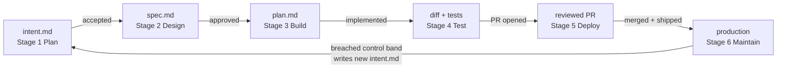
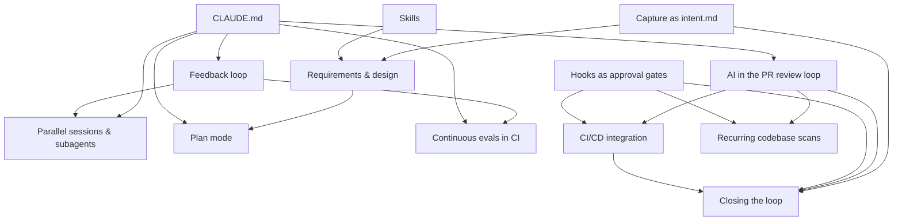

# Playbook → repo map

Every play from [The AI-Native SDLC Playbook](https://claude.com/blog/the-ai-native-sdlc-playbook)
exists in this repo as a working file. This page is the index.

## The loop

The AI-native SDLC is a loop, not a line. A stage ends by committing an
artifact, and the commit initiates the next stage:

An accepted `intent.md` triggers the requirements-and-design pass, an
approved `spec.md` triggers plan mode, a merged PR triggers the pipeline,
and a breached control band in production writes the next `intent.md` — and
so the loop continues. Human attention concentrates at the gates.

## Stage-by-stage map

| Stage | Play | Where it lives in this repo |
| --- | --- | --- |
| 1 Plan | Capture as intent.md | `intent/` (home + README), `templates/intent.md`, `.claude/skills/intent-capture/`, `/capture-intent` command |
| 2 Design | Requirements and design | `/write-spec` command, `.github/workflows/spec-from-intent.yml`, `templates/spec.md`, skills as constraints (`secure-api-review`, `brand-voice`) |
| 3 Build | Plan mode as the default start | `templates/plan.md`, worked example `intent/claims-status-self-service/plan.md` |
| 3 Build | The CLAUDE.md | `CLAUDE.md` |
| 3 Build | Skills as institutional knowledge | `.claude/skills/*/SKILL.md` |
| 3 Build | Hooks as build-time guardrails | `.claude/hooks/protect-paths.sh`, `.claude/hooks/lint-on-edit.sh`, wired in `.claude/settings.json` |
| 3 Build | Parallel sessions and subagents | `.claude/agents/verifier.md`, `code-simplifier.md`, `researcher.md`; worktree how-to in README |
| 4 Test | Give Claude a feedback loop | `Makefile` (build/test/lint/run), CLAUDE.md "Verifying your work", `.claude/hooks/protect-tests.sh` |
| 4 Test | Continuous evals in CI | `evals/` + `.github/workflows/agent-evals.yml` |
| 5 Deploy | AI in the PR review loop | `REVIEW.md` + `.github/workflows/claude-review.yml`, `/babysit-pr` command, `.github/CODEOWNERS` |
| 5 Deploy | Hooks as approval gates | `.claude/hooks/production-gate.sh`, `managed-settings/` |
| 5 Deploy | CI/CD integration and deployment | `.github/workflows/ci.yml` (triage step), branch protection + PR-only writes |
| 6 Maintain | Closing the loop | `monitoring/` (bands.yaml, detect.py, tests) + `.github/workflows/monitor.yml` |
| 6 Maintain | Recurring codebase scans | Findings route: bounded fix → PR through the review gate; wider → `intent/` in Stage 1 format (see `monitoring/README.md`) |
| 6 Maintain | Claude on call (Claude Tag) | Pattern documented in `monitoring/README.md` — incidents arriving via channels enter the same loop |

## Adoption order

The plays are modular; the arrows are dependencies, not the stage order.
Start with any play nothing points into:

No-prerequisite entry points: **CLAUDE.md**, **Capture as intent.md**,
**Skills**, **Hooks as approval gates**, and the **feedback loop**. The
fully closed loop (Stage 6) comes last, because it invokes everything else
without a person in the path.
